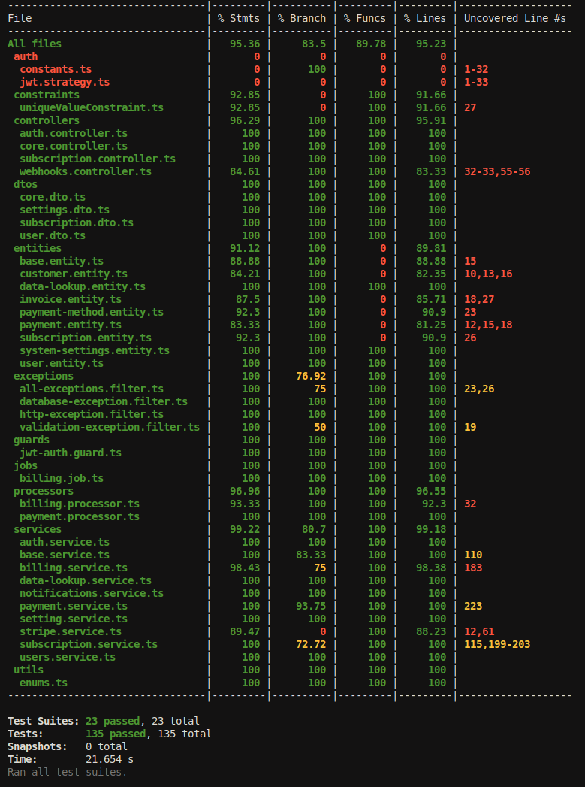

# SaaS Billing App - Case Study

## Overview
This project is a simple billing application designed for a SaaS platform that supports multiple subscription tiers and handles recurring billing. The app is built using NestJS, and it implements core features such as subscription management, billing engine, payment processing, and notifications. Additionally, it includes a serverless function for invoice generation.

## Table of Contents
- [Overview](#overview)
- [Entities](#entities)
  - [BaseEntity](#baseentity)
  - [DataLookup](#datalookup)
  - [CustomerSubscription](#customersubscription)
  - [Invoice](#invoice)
  - [PaymentMethod](#paymentmethod)
  - [Payment](#payment)
  - [SubscriptionPlan](#subscriptionplan)
  - [SystemSetting](#systemsetting)
  - [User](#user)
- [Core Features](#core-features)
  - [SubscriptionService](#subscriptionservice)
  - [BillingService](#billingservice)
  - [PaymentService](#paymentservice)
  - [AuthService](#authservice)
  - [DataLookupService](#datalookupservice)
  - [NotificationsService](#notificationsservice)
  - [UsersService](#usersservice)
  - [SystemSettingService](#systemsettingservice)
  - [StripeService](#stripeservice)
- [Invoice Generation Function (Optional)](#invoice-generation-function-optional)
  - [Serverless Function Implementation](#serverless-function-implementation)
  - [Invoice Calculation](#invoice-calculation)
  - [Data Storage](#data-storage)
- [Directory Structure](#directory-structure)
  - [coverage](#coverage)
  - [node_modules](#node_modules)
  - [src](#src)
    - [index.test.ts](#indextestts)
    - [index.ts](#indexts)
  - [package-lock.json](#package-lockjson)
  - [package.json](#packagejson)
  - [README.md](#readmemd)
  - [tsconfig.json](#tsconfigjson)
  - [wrangler.toml](#wranglertoml)
  - [app](#app)
    - [assets/images](#assetsimages)
    - [db](#db)
      - [migrations](#migrations)
      - [seeders](#seeders)
        - [data-lookup](#data-lookup)
        - [settings](#settings)
      - [data-source.ts](#data-sourcets)
  - [dist](#dist)
  - [src](#src)
    - [auth](#auth)
    - [constraints](#constraints)
      - [uniqueValueConstraint.ts](#uniquevalueconstraintts)
    - [controllers](#controllers)
      - [auth.controller.ts](#authcontrollerts)
      - [core.controller.ts](#corecontrollerts)
      - [subscription.controller.ts](#subscriptioncontrollerts)
      - [webhooks.controller.ts](#webhookscontrollerts)
    - [dtos](#dtos)
    - [entities](#entities-1)
    - [exceptions](#exceptions)
      - [all-exceptions.filter.ts](#all-exceptionsfilterts)
      - [database-exception.filter.ts](#database-exceptionfilterts)
      - [http-exception.filter.ts](#http-exceptionfilterts)
      - [validation-exception.filter.ts](#validation-exceptionfilterts)
    - [guards](#guards)
      - [jwt-auth.guard.ts](#jwt-authguardts)
    - [jobs](#jobs)
      - [billing.job.ts](#billingjobts)
    - [processors](#processors)
      - [billing.processor.ts](#billingprocessorts)
      - [payment.processor.ts](#paymentprocessorts)
    - [services](#services)
    - [utils](#utils)
    - [app.module.ts](#appmodulets)
    - [main.ts](#maints)
  - [tests](#tests)
    - [constraints](#constraints-1)
      - [uniqueValueConstraint.spec.ts](#uniquevalueconstraintspects)
    - [controllers](#controllers-1)
    - [exceptions](#exceptions-1)
    - [jobs](#jobs-1)
      - [billing.job.spec.ts](#billingjobspects)
    - [processors](#processors-1)
    - [services](#services-1)
- [Requirements](#requirements)
- [Technologies Used](#technologies-used)
- [Steps to Spin Up the Application Service in a New Environment](#steps-to-spin-up-the-application-service-in-a-new-environment)
  - [Ensure Prerequisites](#1-ensure-prerequisites)
  - [Clone the Repository](#2-clone-the-repository)
  - [Set Up Environment Variables](#3-set-up-environment-variables)
  - [Build and Start the Services with Docker Compose](#4-build-and-start-the-services-with-docker-compose)
  - [Initialize the Database](#5-initialize-the-database)
  - [Access the Application](#6-access-the-application)
  - [Monitor and Manage Containers](#7-monitor-and-manage-containers)
  - [Running Tests (Optional)](#8-running-tests-optional)
- [Using the APIs](#using-the-apis)
- [Summary](#summary)


## Entities


### BaseEntity
Represents the base entity that other entities inherit from.

- `id`: Unique identifier for the entity (UUID).
- `objectState`: Reference to a `DataLookup` entity representing the current state of the instance of the entity.
- `createdDate`: Timestamp indicating when the entity was created.
- `updatedDate`: Timestamp indicating when the entity was last updated.
- `deletedDate`: Timestamp indicating when the entity was deleted (nullable).

### DataLookup
Represents a generic lookup table used for defining types, statuses, and other categorizations.

- `id`: Unique identifier for the lookup value (UUID).
- `type`: Type of the lookup value.
- `name`: Name of the lookup value.
- `value`: Unique value representing the lookup (must be unique).
- `description`: Description of the lookup value (nullable).
- `category`: Category of the lookup value (nullable).
- `note`: Additional notes regarding the lookup value (nullable).
- `index`: Index for ordering or sorting the lookup values.
- `is_default`: Indicates if this is the default value (boolean).
- `is_active`: Indicates if the lookup value is active (boolean).
- `remark`: Additional remarks about the lookup value (nullable).
- `createdDate`: Timestamp indicating when the lookup value was created.
- `updatedDate`: Timestamp indicating when the lookup value was last updated.

### CustomerSubscription
Represents a customer's subscription to a particular plan.

- `id`: Unique identifier for the subscription (UUID).
- `user`: Reference to the `User` entity who owns the subscription.
- `subscriptionPlan`: Reference to the `SubscriptionPlan` entity for the subscribed plan.
- `subscriptionStatus`: Reference to the `DataLookup` entity representing the subscription status.
- `startDate`: Date when the subscription started.
- `endDate`: Date when the subscription ended (nullable).
- `retryCount`: Number of retry attempts for payment.
- `nextRetry`: Date of the next retry attempt (nullable).
- `nextBillingDate`: Date of the next billing cycle.

### Invoice
Represents an invoice generated for a customer.

- `id`: Unique identifier for the invoice (UUID).
- `customerId`: Identifier for the customer (string).
- `amount`: Amount to be paid, stored as a decimal.
- `status`: Reference to the `DataLookup` entity representing the invoice status.
- `paymentDueDate`: Date when the payment is due.
- `paymentDate`: Date when the payment was made (nullable).
- `subscription`: Reference to the `CustomerSubscription` entity related to the invoice.

### PaymentMethod
Represents a method used for processing payments.

- `id`: Unique identifier for the payment method (UUID).
- `code`: Unique code for the payment method.
- `name`: Name of the payment method.
- `accountHolderName`: Name of the account holder (nullable).
- `accountNumber`: Account number associated with the payment method (nullable).
- `logo`: Logo image URL for the payment method (nullable).
- `type`: Reference to the `DataLookup` entity representing the payment method type.

### Payment
Represents a payment made by a customer.

- `id`: Unique identifier for the payment (UUID).
- `amount`: Amount paid, stored as a decimal.
- `status`: Reference to the `DataLookup` entity representing the payment status.
- `invoice`: Reference to the `Invoice` entity related to this payment.
- `paymentMethod`: Reference to the `PaymentMethod` entity used for this payment.
- `referenceNumber`: Unique reference number for the payment.
- `payerName`: Name of the person or entity that made the payment.
- `paymentDate`: Date when the payment was made (nullable).

### SubscriptionPlan
Represents a subscription plan available to customers.

- `id`: Unique identifier for the subscription plan (UUID).
- `name`: Name of the subscription plan (e.g., "Basic", "Pro").
- `description`: Detailed description of the plan (nullable).
- `price`: Price of the subscription plan, stored as a decimal.
- `billingCycleDays`: Number of days in the billing cycle.
- `status`: Reference to the `DataLookup` entity representing the plan's status.
- `prorate`: Indicates if the plan supports prorated billing (boolean).

### SystemSetting
Represents a configurable system setting.

- `id`: Unique identifier for the system setting (UUID).
- `name`: Name of the setting.
- `code`: Unique code for the setting.
- `defaultValue`: Default value for the setting.
- `currentValue`: Current value of the setting.

### User
Represents a user of the SaaS platform.

- `id`: Unique identifier for the user (UUID).
- `name`: User's name.
- `email`: User's email address (unique).
- `password`: User's hashed password.
- `phoneNumber`: User's phone number (nullable).

## Core Features

The core features of the system revolve around managing customer subscriptions, billing, payments, user authentication, and system settings. Below is a breakdown of the services that provide these features:

---

### SubscriptionService
Handles operations related to customer subscriptions and subscription plans.

- **createCustomerSubscription**:
  - Creates a new subscription for a user.
  - Validates the user and subscription plan.
  - Sets the subscription status to `PENDING` and calculates the next billing date.

- **getCustomerSubscriptions**:
  - Retrieves all subscriptions for a given user.
  - Ensures the user exists before fetching the subscriptions.

- **updateSubscriptionStatus**:
  - Updates the status of a specific subscription.
  - Can modify the end date of the subscription if provided.

- **createSubscriptionPlan**:
  - Creates a new subscription plan.
  - Ensures that a default state is set for the subscription plan.

- **getSubscriptionPlans**:
  - Retrieves all available subscription plans.

- **getSubscriptionPlanById**:
  - Retrieves a specific subscription plan by its ID.

- **updateSubscriptionPlan**:
  - Updates the details of a subscription plan, including its status.

- **deleteSubscriptionPlan**:
  - Deletes a subscription plan by its ID.

---

### BillingService
Manages the billing process, including invoice generation and handling subscription changes.

- **scheduleInvoiceGeneration**:
  - Schedules invoice generation for active subscriptions due for billing.

- **createInvoiceForSubscription**:
  - Generates an invoice for a specific subscription.
  - Sends an email notification to the user upon invoice generation.

- **handleSubscriptionChange**:
  - Manages subscription upgrades or downgrades.
  - Calculates prorated amounts based on the subscription change.

- **getSubscriptionById**:
  - Retrieves a subscription by its ID.

- **calculateNextBillingDate**:
  - Calculates the next billing date based on the current date and billing cycle.

- **calculateProratedAmount**:
  - Calculates the prorated cost when a subscription plan changes.

- **scheduleRetry**:
  - Schedules a payment retry for a failed payment.

- **retryPayment**:
  - Attempts to process a payment retry.

- **confirmPayment**:
  - Confirms a successful payment and updates the subscription status to `ACTIVE`.

---

### PaymentService
Handles payment processing, including successful and failed payment handling, and retries.

- **handleSuccessfulPayment**:
  - Processes a successful payment.
  - Updates the invoice status to `PAID` and sends a success notification.

- **handleFailedPayment**:
  - Processes a failed payment.
  - Updates the subscription status to `OVERDUE` and schedules a retry.

- **scheduleRetry**:
  - Schedules a retry for a failed payment attempt.

- **retryPayment**:
  - Attempts to process a payment retry.

- **getDefaultPaymentMethod**:
  - Retrieves the default payment method configured in the system.

- **confirmPayment**:
  - Confirms and finalizes a successful payment for a subscription.

---

### AuthService
Manages user authentication, including login, registration, and token generation.

- **validateUser**:
  - Validates user credentials (email and password) and returns a JWT token if successful.

- **login**:
  - Logs in a user and returns a JWT token.

- **register**:
  - Registers a new user in the system.

- **verifyPassword**:
  - Verifies the user's password against the stored hashed password.

- **generateJwtToken**:
  - Generates a JWT token for an authenticated user.

---

### DataLookupService
Handles operations on the `DataLookup` entity, which is used for generic lookup values like statuses and types.

- **existsByValue**:
  - Checks if a `DataLookup` value exists.

- **create**:
  - Creates a new `DataLookup` entry.

- **createBulk**:
  - Creates multiple `DataLookup` entries in bulk.

- **findAll**:
  - Retrieves all `DataLookup` entries.

- **findOne**:
  - Retrieves a `DataLookup` entry by its ID.

---

### NotificationsService
Handles email notifications related to invoices, payments, and other events.

- **sendInvoiceGeneratedEmail**:
  - Sends an email notification when an invoice is generated.

- **sendPaymentSuccessEmail**:
  - Sends an email notification when a payment is successful.

- **sendPaymentFailureEmail**:
  - Sends an email notification when a payment fails.

---

### UsersService
Handles operations related to users, including finding, creating, and updating user records.

- **findOneByEmail**:
  - Finds a user by their email address.

- **findOne**:
  - Finds a user by their ID.

- **create**:
  - Creates a new user with a hashed password.

---

### SystemSettingService
Manages system-wide settings that can be configured by administrators.

- **create**:
  - Creates a new system setting with a default value.

- **findAll**:
  - Retrieves all system settings.

- **findOne**:
  - Retrieves a system setting by its ID.

- **update**:
  - Updates a system setting.

- **remove**:
  - Deletes a system setting.

- **resetSetting**:
  - Resets a system setting's current value to its default value.

---

### StripeService
Integrates with the Stripe payment gateway to handle payments and invoicing.

- **createPaymentIntent**:
  - Creates a payment intent with Stripe.

- **retrieveInvoice**:
  - Retrieves a Stripe invoice by its ID.

- **payInvoice**:
  - Pays a Stripe invoice.

- **constructEvent**:
  - Constructs a Stripe event from a webhook payload and signature.

---

These services work together to provide a comprehensive system for managing subscriptions, billing, payments, and user authentication, with support for various operational tasks like notifications and system settings.

## Invoice Generator

This project is a serverless function designed for generating invoices based on customer subscription plans. The function is implemented using TypeScript and can be deployed on serverless platforms such as Cloudflare Workers or AWS Lambda.

## Directory Structure

- **coverage/**:  
  This directory contains code coverage reports generated after running tests. It helps to determine the extent to which the codebase is covered by tests, highlighting areas that may need additional testing.

- **node_modules/**:  
  This directory houses all the dependencies installed via npm (Node Package Manager). These modules are necessary for the project to function but should not be modified directly.

- **src/**
  - **index.test.ts**:  
    This file contains unit tests for the `index.ts` file. These tests ensure that the invoice generation logic is functioning as expected and help prevent regressions in the code.
  
  - **index.ts**:  
    This is the main source file where the invoice generation logic is implemented. It contains the function that calculates invoices based on customer subscription data and stores the generated invoices in-memory or in a mock database.

- **package-lock.json**:  
  This file locks the versions of the project's dependencies, ensuring consistent installations across different environments. It is automatically generated when npm dependencies are installed.

- **package.json**:  
  This file provides metadata about the project, including the project name, version, and dependencies. It also contains scripts for building, testing, and running the application.

- **README.md**:  
  This file, which you are currently reading, provides an overview of the project, how to set it up, and how to use it.

- **tsconfig.json**:  
  The TypeScript configuration file. It defines the compiler options used by TypeScript to build the project, such as the target JavaScript version, module system, and paths for input/output files.

- **wrangler.toml**:  
  This configuration file is used for deploying the serverless function using Cloudflare Workers. It contains settings for the deployment environment, such as account details, environment variables, and function triggers.

## Invoice Generation Function

### Serverless Function Implementation

The logic for generating invoices is implemented as a serverless function. This function can be deployed on platforms like Cloudflare Workers or AWS Lambda, offering scalable and cost-efficient execution.

### Invoice Calculation

The function calculates the invoice amount based on the customer’s current subscription plan. This process involves determining the appropriate billing cycle, applying any necessary prorations or discounts, and calculating the final amount due.

### Data Storage

Generated invoices are temporarily stored in a simple in-memory structure or a mock database during the function's runtime. Depending on the deployment setup, this data can either be stored locally in the serverless environment or pushed to a more persistent storage solution.

### Project Structure Overview

The project structure is organized in a way that promotes separation of concerns, making the application modular, maintainable, and scalable. Here's an explanation of the various folders and their purposes:

- **app**
  - **assets/images**: This folder contains static image files used within the application. It might be used for logos, icons, or any other image assets required by the app.
  
  - **db**
    - **migrations**: This folder is used to store database migration scripts. Migrations are used to modify the database schema over time in a controlled and versioned manner.
    - **seeders**
      - **data-lookup**: Contains seed data and scripts for initializing the `DataLookup` table with predefined values.
        - `create.runner.ts`: Script for running the seeding process.
        - `create.seeder.ts`: Script defining the logic for seeding data into the `DataLookup` table.
        - `data.json`: JSON file containing the data to be seeded into the database.
      - **settings**: Similar to `data-lookup`, but for seeding system settings into the database.
        - `create.runner.ts`: Script for running the seeding process for settings.
        - `create.seeder.ts`: Script defining the logic for seeding system settings.
        - `data.json`: JSON file containing the settings data to be seeded into the database.
    - **data-source.ts**: This file is used to configure the database connection, including specifying the type of database, connection options, and potentially setting up entities and migrations.

- **dist**: This is the output directory for compiled TypeScript files. After building the project, the compiled JavaScript files are placed here. This directory is automatically generated and managed by the build process, typically through a tool like `tsc` (TypeScript compiler).

- **node_modules**: This directory contains all the installed npm packages required by the project. It's automatically generated when running `npm install` or `yarn install`.

- **src**
  - **auth**
    - Contains modules related to authentication, including the implementation of JWT authentication, guards, and controllers.
    
  - **constraints**
    - **uniqueValueConstraint.ts**: A custom validation constraint, used to enforce uniqueness on certain fields within the application, such as ensuring a unique email or username.

  - **controllers**
    - **auth.controller.ts**: Handles HTTP requests related to authentication, such as login, registration, and token management.
    - **core.controller.ts**: Possibly manages core functionality and routes that are central to the application’s operation.
    - **subscription.controller.ts**: Manages HTTP requests related to subscription management, such as creating and updating subscriptions.
    - **webhooks.controller.ts**: Handles incoming webhook requests, possibly from third-party services like Stripe for payment notifications.

  - **dtos**: Contains Data Transfer Objects (DTOs) used to define the shape of data sent and received by the application. DTOs are typically used for validation and type safety.

  - **entities**: Contains entity definitions, which map to database tables. These are usually TypeScript classes decorated with TypeORM decorators to define the schema of the tables and their relationships.

  - **exceptions**
    - **all-exceptions.filter.ts**: A global exception filter that handles all uncaught exceptions in the application.
    - **database-exception.filter.ts**: Specifically handles exceptions related to database operations.
    - **http-exception.filter.ts**: Handles standard HTTP exceptions.
    - **validation-exception.filter.ts**: Handles exceptions related to validation failures, thrown when DTO validation fails.

  - **guards**
    - **jwt-auth.guard.ts**: Implements a JWT authentication guard to protect routes by ensuring that only authenticated users can access them.

  - **jobs**
    - **billing.job.ts**: Contains logic related to scheduled billing tasks, such as generating invoices or processing payments.
  
  - **processors**
    - **billing.processor.ts**: Handles the processing logic for billing-related tasks, possibly run as background jobs.
    - **payment.processor.ts**: Manages payment processing tasks, potentially involving integration with payment gateways like Stripe.

  - **services**: This directory contains service classes, which encapsulate business logic. Services interact with repositories to perform operations on entities and implement the core functionality of the application.

  - **utils**: Contains utility functions and constants used across the application. These may include enums, helper functions, or common utilities.

  - **app.module.ts**: The root module of the NestJS application, which aggregates all other modules and configures the application.

  - **main.ts**: The entry point of the application. It bootstraps the NestJS application and starts the server.

- **tests**
  - **constraints**: Contains test files related to the custom validation constraints.
    - **uniqueValueConstraint.spec.ts**: Test suite for the `uniqueValueConstraint`.
  - **controllers**: Contains test files for the controllers, ensuring that the routes and logic behave as expected.
  - **exceptions**: Contains test files for exception filters.
  - **jobs**
    - **billing.job.spec.ts**: Test suite for the `billing.job.ts`, ensuring the billing tasks function correctly.
  - **processors**: Contains test files for the processor classes.
  - **services**: Contains test files for the service classes.


## Requirements
- NestJS
- Node.js
- Serverless platform (e.g., Cloudflare worker)

## Technologies Used
- **NestJS**: A progressive Node.js framework for building efficient and scalable server-side applications.
- **TypeScript**: A statically typed superset of JavaScript that enhances code reliability.
- **Serverless Framework**: Used for deploying serverless functions.
- **In-memory Database**: For storing customer, subscription, invoice, and payment data.

## Steps to Spin Up the Application Service in a New Environment

#### 1. **Ensure Prerequisites**
Make sure the following are installed on your machine:
- **Docker**: Download and install Docker from [docker.com](https://www.docker.com/).
- **Docker Compose**: Docker Compose is usually included with Docker Desktop, but ensure it is available by running `docker compose --version`.

#### 2. **Clone the Repository**
Clone the project repository from your version control system.

```bash
git clone git@github.com:Nabute/saas_billing.git
cd saas_billing
```

#### 3. **Set Up Environment Variables**
Create a `.env` file in the root of your project if it doesn’t already exist. Populate it with the necessary environment variables, such as database credentials, JWT secret, and other configuration settings. Refer to the provided `.env.example` if available.

Example:
```env
#Database configuration settings
DB_TYPE=postgres
DB_NAME=billing_dev
DB_HOST=postgres
DB_PORT=5432
DB_USER=postgres
DB_PASSWORD=postgres

# PG Admin
POSTGRES_PASSWORD=postgres
PGADMIN_DEFAULT_EMAIL=admin@admin.com
PGADMIN_DEFAULT_PASSWORD=password

# Password Hash
SECRET=dsfsdfsdf

# API Version
API_VERSION=1

# Redis configuration settings
REDIS_HOST=redis
REDIS_PORT=6379
REDIS_PASSWORD=sldkfjstsldkfj

# SMTP configuration for Nodemailer
EMAIL_HOST=smtp.ethereal.email
EMAIL_PORT=587
EMAIL_USER=jimmie.treutel@ethereal.email
EMAIL_PASS=w5qEGb514nzhSftC6R

# Stripe
STRIPE_SECRET=ksjlkdfjlsdkfjlskdfjlsdkjf
```

#### 4. **Build and Start the Services with Docker Compose**
Ensure that Docker is running, then build and start the application services using Docker Compose.

```bash
docker compose up --build
```

This command will:
- **Build the Docker image for the application** using the `Dockerfile` located in the `./app` directory.
- **Start the application service (`app`)** along with `Postgres`, `Redis`, and `pgAdmin` services.
- **Map ports** so you can access the application on `localhost:3000`, Postgres on `localhost:5454`, Redis on `localhost:6363`, and pgAdmin on `localhost:5422`.

The `depends_on` and `healthcheck` configurations ensure that the `app` service waits for `Postgres` and `Redis` to be healthy before starting.

#### 5. **Initialize the Database**
Once the containers are up, you may need to run database migrations and seed initial data.

1. **Access the running container**:
   ```bash
   docker compose exec app sh
   ```

2. **Run database migrations** to set up the database schema:
   ```bash
   npm run migration:run
   ```

3. **Seed the database** with initial data:
   ```bash
   npm run seed:data-lookup
   npm run seed:settings
   ```

#### 6. **Access the Application**
Once the services are running, you can access:
- **The application** at `http://localhost:3000`
- **API Documentation (Swagger)** can be found at `http://localhost:3000/api/docs`
- **pgAdmin** at `http://localhost:5422` (use the credentials from your `.env` file)
- **Redis** at `localhost:6363` (via Redis CLI or a GUI like RedisInsight)

#### 7. **Monitor and Manage Containers**
- To **view logs** of the running containers:
  ```bash
  docker compose logs -f
  ```
- To **stop the services**:
  ```bash
  docker compose down
  ```
- To **stop and remove containers, networks, and volumes**:
  ```bash
  docker compose down --volumes
  ```

#### 8. **Running Tests (Optional)**
To run tests within the Docker container:
1. Access the running container:
   ```bash
   docker compose exec app sh
   ```
2. Run the tests:
   ```bash
   npm run test
   ```

   or to see the coverage report
   ```bash
   npm run test:cov
   ```
   and here is the current test coverage report
   
   


## Using the APIs

Follow the steps below to get started with testing the API using Postman.

### 1. Prerequisites
- Ensure that [Postman](https://www.postman.com/downloads/) is installed on your system.

### 2. Import the Postman Collection
1. Download the Postman collection file: [BillingAPI.postman_collection.json](./SaaS%20Subscription%20Billing.postman_collection.json).
2. Open Postman.
3. Click the `Import` button located in the top left corner.
4. Choose the `File` option and select the downloaded Postman collection.
5. The collection will be imported and available in your Postman workspace.

### 3. Testing the API Endpoints
1. Expand the imported collection to view the available API endpoints.
2. Navigate to the `User` folder and select the `Register` request.
3. Click `Send` to execute the request.
4. Copy the `userId` from the response of the `Register` request.
5. Navigate to the `Plans` folder and select the `Create` request.
6. Use both provided examples to create two new Subscription Plans.
7. Copy the `subscriptionPlanId` of one of the created plans.
8. Navigate to the `Subscription` folder and select the `Subscribe` request.
9. Update the request body with the `userId` and `subscriptionPlanId` as shown below:

    ```json
    {
        "userId": "15f066f6-69c8-4a20-b558-90b6967c5c13",
        "subscriptionPlanId": "6734a124-dd43-4623-b2e5-6a085cabc50e"
    }
    ```

10. Submit the `Subscribe` request.

11. Copy the `invoiceId` from the response of the `Subscribe` request.
12. Navigate to the `Payment` folder and select the `Process` request.
13. Replace the `invoiceId` in the request body with the new `invoiceId`. Leave the `paymentMethodId` unchanged.
14. Submit the `Process` request. You should receive a response indicating success:

    ```json
    {
        "success": true
    }
    ```

Congratulations! You have successfully subscribed and processed payment for your subscription.


### 4. Email Notifications

This API uses Ethereal, a fake SMTP service, to simulate email notifications. Ethereal is primarily designed for Nodemailer and EmailEngine users, but it can be used with other applications as well. It is a free service where emails are not actually delivered but can be viewed for testing purposes.

To view the simulated emails:
1. Visit the [Ethereal website](https://ethereal.email/).
2. Log in using the email address and password configured in the SMTP settings, which can be found in the `.env` file.
3. Once logged in, you can review the emails that were "sent" during the testing process.

Ethereal is ideal for development and testing environments where real email delivery is not required.


## Summary
By following these steps, you should have a fully functional environment for the SaaS Billing application, running in Docker containers. This setup ensures that the application is consistent across different environments and simplifies deployment and management of the services.


## Thank You

Thank you for the opportunity to work on this project as part of the technical screening process. I appreciate the chance to demonstrate my skills and look forward to any feedback you may have. Please feel free to reach out if you have any questions or need further clarification on any part of the project.

Best regards,

Daniel Nigusse
